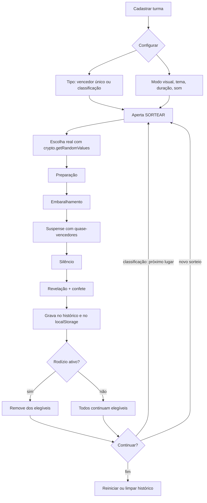

# 🎲 QUEM SERÁ?

Sorteio de sala de aula com cara de programa de auditório. O professor cadastra nomes, números ou emojis, aperta **SORTEAR** e a turma acompanha uma revelação com suspense, luzes e confete.

**[xablau.netlify.app](https://xablau.netlify.app)**

Aplicação 100% estática: sem backend, sem banco, sem login. Depois de carregada, funciona offline.

---

## O que faz

- **Dois tipos de sorteio:** vencedor único ou classificação completa (1º, 2º, 3º… até o último, com opção de parar antes).
- **Sorteio justo:** escolha por `crypto.getRandomValues()` com rejeição de amostra. O resultado é definido antes da animação — a encenação só revela.
- **Quatro modos visuais** (game show, hacker, foguete, caos) e **quatro temas**, incluindo um claro para projetor.
- **Cadastro da turma** individual ou colando a chamada inteira, uma linha por participante.
- **Rodízio** "não repetir vencedores" com contador, e **histórico** dos últimos sorteados.
- **Modo tela cheia** para projetor, som gerado via Web Audio API (sem arquivos), navegação por teclado e suporte a `prefers-reduced-motion`.
- Participantes, histórico e configurações ficam no `localStorage` (se estiver bloqueado, a app continua funcionando sem guardar nada).

### Atalhos

`Espaço` sortear · `F` tela cheia · `R` embaralhar · `S` som · `M` trocar modo · `Esc` fechar / cancelar

---

## Desenvolvimento

```bash
npm install
npm run dev       # http://localhost:5173
npm run build     # gera dist/
npm test          # verificação em DOM simulado (Node 18+)
```

`npm run build:single` gera `dist-single/quem-sera.html` com JS, CSS e fontes embutidos — um arquivo só que roda de pendrive.

Stack: React 18, Vite 5, CSS moderno. Fontes servidas via `@fontsource`, confete em `<canvas>` puro, som em osciladores da Web Audio API. Sem CDN, sem biblioteca de animação.

---

## Deploy

`netlify.toml` já traz build, publish directory e redirects. Pelo Git: *Add new site → Import an existing project*, e cada push na branch principal reconstrói o site. Sem servidor Node em produção.

O `og:image` precisa de URL absoluta. A de produção (`https://xablau.netlify.app`) está
no `index.html`; em preview do Netlify o `vite.config.js` troca pelo `DEPLOY_PRIME_URL`.
Trocou de domínio? Ajuste o `index.html` e `SITE_URL_IN_HTML` no `vite.config.js`.

---

## Fluxo da ferramenta


